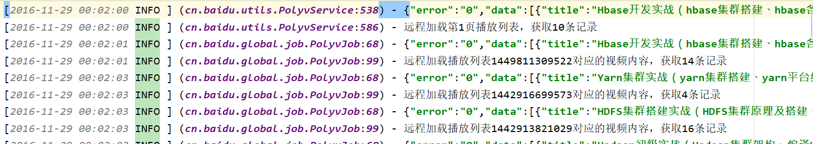

<br>

### 项目二 Mapreduce日志统计
---

#### 需求分析
    如图


>  有一份网站访问日志(含有脏数据)，请按照 ip 统计用户访问情况，要求显
示结果如下格式所示：

| ip      |      |
| --------- | ---- |
| timecount| 表示一共停留多长时间 |
| starttime| 第一次访问时间 |
| startpage| 第一次访问的 url |
| lasttime|   最后一次访问时间   |
| lastpage|     最后访问的页面 |
| pagecount| 一共访问多少个页面 |
#### 思路 

```
使用MapReduce，以ip作为表示，进行数据清洗，将所需要的数据封装到一个bean对象。从map到reduce的过程中，计算出各项所需要的数据，一个ip作为一个reduce任务。
```


